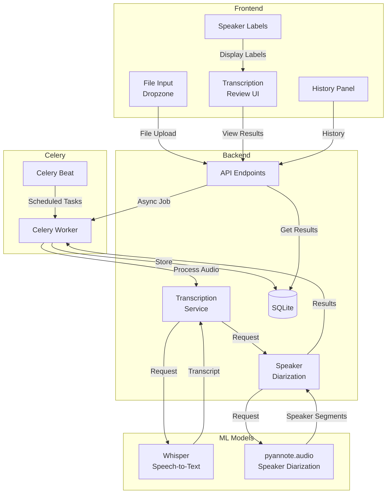
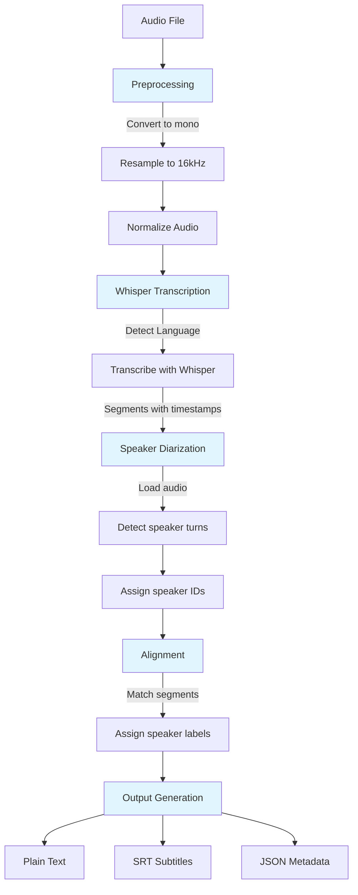

# Transcription App Design Document

## Overview
This document outlines the architecture and design for a transcription application that converts audio to text and identifies different speakers (speaker diarization).

## Tech Stack

### Frontend
- **Framework**: React 18+ with TypeScript
- **Styling**: Tailwind CSS
- **File Handling**: React Dropzone for drag-and-drop file uploads
- **State Management**: React Context API / Zustand
- **UI Components**: shadcn/ui (built on Radix UI primitives)

### Backend
- **Framework**: FastAPI (Python)
- **Transcription Engine**: OpenAI Whisper (base or small model)
- **Speaker Diarization**: pyannote.audio
- **Task Queue**: Celery with Redis (for async processing)
- **Database**: SQLite for storing transcriptions and metadata

### Development
- **Containerization**: Docker (for consistent environment)
- **Package Management**: pip (Python), npm (JavaScript)

---

## Architecture Diagram



**Diagram Explanation**: The architecture shows a layered approach with React frontend handling user interaction, FastAPI backend providing REST APIs, Celery for async task processing, and ML models (Whisper and pyannote.audio) for transcription and speaker identification. Data is stored in SQLite.

---

## System Components

### 1. File Upload & Processing
- Accept audio/video files via drag-and-drop
- Supported formats: MP3, WAV, MP4, MOV, M4A, FLAC
- Validate file size (max 500MB for free tier)
- Store files temporarily in `/tmp` or configured upload directory

### 2. Transcription Service
- Uses Whisper model for speech-to-text
- Output includes: text, timestamps, confidence scores
- Process asynchronously via Celery queue

### 3. Speaker Diarization
- Uses pyannote.audio for speaker segmentation
- Assigns speaker labels (Speaker 1, Speaker 2, etc.)
- Aligns diarization with Whisper transcriptions
- Output includes speaker turn timestamps

### 4. Output Generation
- Plain text (conversation format)
- SRT subtitles with timestamps
- JSON with full metadata
- Display with color-coded speaker labels

---

## API Endpoints

### POST /api/transcribe
Upload and transcribe an audio file.

**Request:**
```json
{
  "file": "base64_encoded_audio",
  "filename": "recording.mp3",
  "model": "base",
  "language": "en"
}
```

**Response:**
```json
{
  "job_id": "uuid",
  "status": "queued",
  "message": "File uploaded, processing started"
}
```

### GET /api/jobs/{job_id}
Check job status and get results.

**Response (complete):**
```json
{
  "job_id": "uuid",
  "status": "completed",
  "result": {
    "text": "Full transcription...",
    "segments": [
      {
        "start": 0.0,
        "end": 3.5,
        "text": "Hello everyone",
        "speaker": "SPEAKER_00",
        "confidence": 0.95
      }
    ],
    "speakers": 2,
    "duration": 120.5
  }
}
```

### GET /api/history
List all transcriptions with metadata.

### DELETE /api/jobs/{job_id}
Delete a transcription job and associated files.

---

## Data Models

### TranscriptionJob
```python
class TranscriptionJob(Base):
    id = Column(String, primary_key=True)
    filename = Column(String)
    original_path = Column(String)
    status = Column(String)  # queued, processing, completed, failed
    created_at = Column(DateTime)
    completed_at = Column(DateTime)
    model = Column(String)  # whisper model name
    language = Column(String)
    speakers_detected = Column(Integer)
    duration = Column(Float)
```

### Segment
```python
class Segment(Base):
    id = Column(Integer, primary_key=True)
    job_id = Column(String, ForeignKey('transcriptionjob.id'))
    start_time = Column(Float)
    end_time = Column(Float)
    text = Column(String)
    speaker = Column(String)
    confidence = Column(Float)
```

---

## File Structure

```
transcriber/
├── backend/
│   ├── app/
│   │   ├── __init__.py
│   │   ├── main.py              # FastAPI app entry point
│   │   ├── config.py            # Configuration
│   │   ├── models.py            # SQLAlchemy models
│   │   ├── schemas.py           # Pydantic schemas
│   │   ├── api/
│   │   │   ├── __init__.py
│   │   │   └── v1/
│   │   │       ├── __init__.py
│   │   │       └── routes.py    # API endpoints
│   │   ├── services/
│   │   │   ├── __init__.py
│   │   │   ├── transcriber.py   # Whisper integration
│   │   │   └── diarizer.py      # pyannote.audio integration
│   │   ├── tasks/
│   │   │   ├── __init__.py
│   │   │   └── celery_app.py    # Celery configuration
│   │   └── utils/
│   │       ├── __init__.py
│   │       └── file_ops.py      # File handling utilities
│   ├── requirements.txt
│   └── Dockerfile
│
├── frontend/
│   ├── src/
│   │   ├── components/
│   │   │   ├── FileUpload.tsx
│   │   │   ├── TranscriptionViewer.tsx
│   │   │   ├── SpeakerLabel.tsx
│   │   │   └── HistoryPanel.tsx
│   │   ├── pages/
│   │   │   ├── Home.tsx
│   │   │   └── History.tsx
│   │   ├── hooks/
│   │   │   ├── useTranscription.ts
│   │   │   └── useApi.ts
│   │   ├── types/
│   │   │   ├── index.ts
│   │   │   └── transcription.ts
│   │   ├── App.tsx
│   │   ├── main.tsx
│   │   └── index.css
│   ├── public/
│   │   └── index.html
│   ├── package.json
│   └── Dockerfile
│
├── docker-compose.yml
└── DESIGN.md
```

---

## Speech-to-Text Processing Pipeline



**Diagram Explanation**: The audio processing pipeline converts input files through preprocessing, Whisper transcription for speech-to-text, pyannote.audio speaker diarization, alignment to match speakers with transcribed text, and finally outputs in multiple formats (text, SRT, JSON).

---

## Configuration

### Backend (.env)
```env
# FastAPI
APP_NAME="Transcriber API"
DEBUG=False
CORS_ORIGINS=http://localhost:3000

# Whisper
WHISPER_MODEL=base
WHISPER_DEVICE=cpu  # cpu or cuda

# pyannote.audio
PYANNOTE_MODEL=pyannote/speaker-diarization

# Celery
CELERY_BROKER_URL=redis://localhost:6379/0
CELERY_RESULT_BACKEND=redis://localhost:6379/0

# File Upload
MAX_UPLOAD_SIZE=524288000  # 500MB
UPLOAD_DIR=/tmp/transcriber

# Database
DATABASE_URL=sqlite:///./transcriber.db
```

### Frontend (.env)
```env
VITE_API_URL=http://localhost:8000/api/v1
VITE_APP_NAME="Transcriber"
VITE_MAX_FILE_SIZE=500
```

---

## Docker Configuration

### docker-compose.yml
```yaml
version: '3.8'

services:
  redis:
    image: redis:7-alpine
    ports:
      - "6379:6379"
    volumes:
      - redis_data:/data

  celery_worker:
    build: ./backend
    command: celery -A app.tasks.celery_app worker --loglevel=info
    depends_on:
      - redis
    volumes:
      - ./backend:/app
      - /tmp/transcriber:/tmp/transcriber

  celery_beat:
    build: ./backend
    command: celery -A app.tasks.celery_app beat --loglevel=info
    depends_on:
      - redis
    volumes:
      - ./backend:/app

  backend:
    build: ./backend
    command: uvicorn app.main:app --host 0.0.0.0 --port 8000 --reload
    ports:
      - "8000:8000"
    depends_on:
      - redis
    volumes:
      - ./backend:/app
      - /tmp/transcriber:/tmp/transcriber

  frontend:
    build: ./frontend
    ports:
      - "3000:3000"
    depends_on:
      - backend

volumes:
  redis_data:
```

---

## Error Handling

### Common Errors
1. **File too large** - Return 413 with error message
2. **Unsupported format** - Return 400 with list of valid formats
3. **Whisper processing error** - Return 500 with details
4. **Speaker diarization timeout** - Return 504 with fallback

### User-Facing Errors
- Clear error messages in UI
- Retry button for transient failures
- Log detailed errors for debugging

---

## Future Enhancements

1. **Cloud API Integration** - Fallback to OpenAI API for faster processing
2. **Multi-language Support** - Better language detection and auto-translation
3. **Custom Vocab** - User-defined vocabulary for better accuracy
4. **Export Options** - DOCX, PDF, Markdown exports
5. **Collaboration** - Share transcriptions, collaborative editing
6. **Real-time** - Live transcription from microphone input
7. **SDK** - Library for programmatic integration